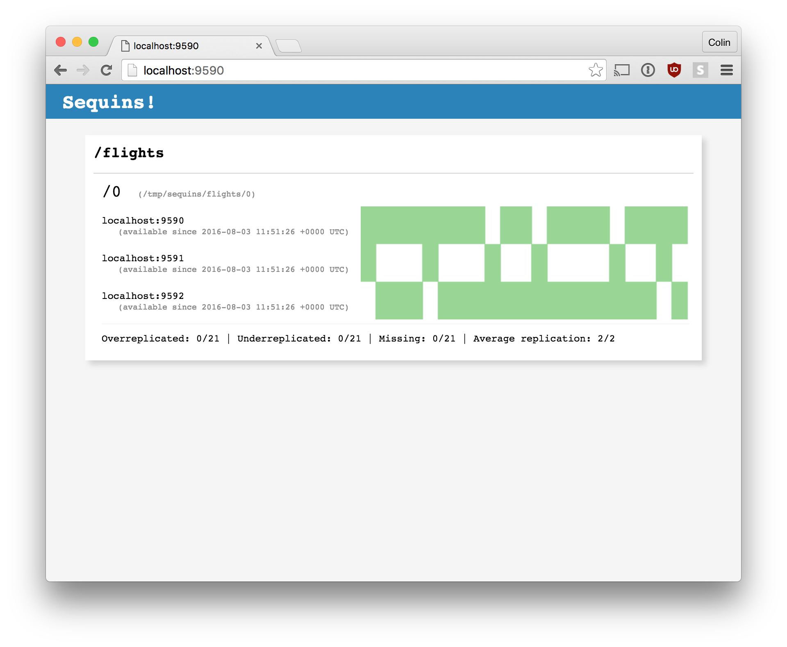

# Healthchecks and Monitoring

### The Status Page and JSON

Visiting the host and port that a sequins node is running on with your browser
will give you a simple status page with sharding and version information for
each database:

The information presented represents the whole cluster in the distributed case,
and should be the same no matter which node you ask. You can also ask for a
specific db, by visiting `/<db>` (in this example: `localhost:9599/flights`).

Finally, you can get a JSON representation of the same information by fetching
with `Accept: application/json`:

    $ http localhost:9599 'Accept:application/json'
    {
        "dbs": {
            "flights": {
              ...

A simplified healthcheck interface is available at the `/healthz` endpoint
which will return a JSON representation of the state of each node. The status
code will either be `200` if at least one version is marked as `ACTIVE` or
`404` if this isn't the case:

    $ http localhost:9599/healthz
    HTTP/1.1 200 OK
    Content-Length: 150
    Content-Type: application/json
    Date: Thu, 02 Nov 2017 00:29:29 GMT
    {
        "baby-names": {
            "1": {
                "active_at": "2017-11-02T00:29:26Z",
                "created_at": "2017-11-02T00:29:26Z",
                "current": true,
                "partitions": [
                    0,
                    1,
                    2,
                    3,
                    4
                ],
                "state": "ACTIVE"
            }
        }
    }

#### Version States

Each version within a database on a Sequins node can exist in one of 5 states.
These states are specific to the version of the database of the Sequins node,
so identical versions can have different states depending on which node they
are on.

- ACTIVE: The version is actively being served on every node within the
  cluster. For a given node, it will only mark a version as ACTIVE if all of
  its partitions have met the minimum replication target and all of its peers
  are also ready to mark the version as ACTIVE. The result of this is that all
  nodes in a cluster should be in agreement about which versions are ACTIVE.
  Generally, only one version within each db should be ACTIVE at a given time,
  but an exception to this is when a node is waiting for its peers to stop
  using an old version after marking a newer one as ACTIVE.

- BUILDING: The existence of the version has been noted and it is currently
  being downloaded and indexed. This version is also capable of being served,
  but does not yet have all of its data.

- REMOVING: The version is in the process of being removed from Sequins as a
  newer version has taken its place and is ACTIVE.

- ERROR: The version has problems and is unable to be processed. For example,
  one of the blocks could be invalid.

### Expvars

You can bind the sequins ["debug" HTTP
server](../x-1-configuration-reference/README.md#debug) to a different port, and
it'll publish go "expvars" at `/debug/vars`.

In addition to the [built in expvars][goexpvar], sequins publishes the following
sequins-specific ones:

 - `sequins.Qps.ByStatus`: A map of HTTP status to a count of requests in the.
   past second

 - `sequins.Qps.Total`: A total of the above.

 - `sequins.Latency`: A histogram of latency values for the last second, with
   `Max`, `Mean`, and `PXX` keys.

 - `sequins.DiskUsed`: The amount of local storage used by sequins.

[goexpvar]: https://golang.org/pkg/expvar/

### Datadog

At Stripe, we use [Datadog][datadog] for statsd-like monitoring with lots of
bells and whistles. We've open-sourced our Datadog plugin for sequins on
[github][ddcheck].

Sequins can also report metrics concerning file downloads from S3 using the
[DogStatsD][dogstatsd] protocol if the `datadog.url` (by default
`localhost:8200`) is set.

[datadog]: https://www.datadoghq.com/
[ddcheck]: https://github.com/stripe/datadog-checks/blob/master/checks.d/sequins.py
[dogstatsd]: https://docs.datadoghq.com/guides/dogstatsd/
